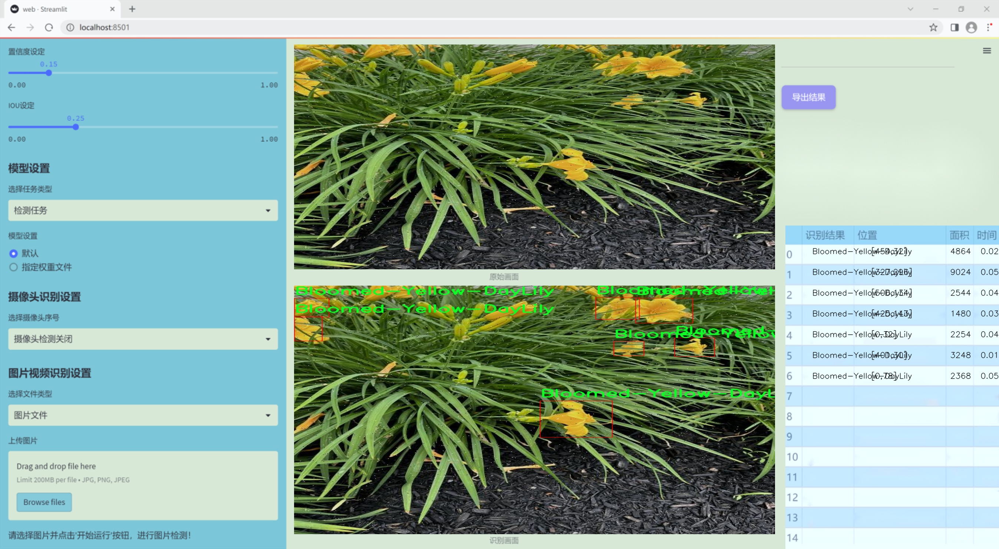

### 1.背景意义

研究背景与意义

随着农业现代化的推进，智能化技术在农作物监测与管理中的应用日益广泛。黄花菜（Hemerocallis fulva）作为一种重要的经济作物，其生长状况直接影响到产量和品质。因此，开发高效的黄花菜检测系统，能够实时监测其生长状态，及时发现病虫害，为农民提供科学的管理建议，具有重要的现实意义和应用价值。

近年来，深度学习技术在计算机视觉领域取得了显著进展，尤其是目标检测算法的快速发展，为农作物的智能监测提供了新的解决方案。YOLO（You Only Look Once）系列算法以其高效的实时检测能力和较高的准确率，成为目标检测领域的热门选择。YOLOv11作为该系列的最新版本，进一步提升了检测精度和速度，适合于农业环境下的应用。

本研究旨在基于改进的YOLOv11算法，构建一个专门针对黄花菜的检测系统。通过使用包含2558张标注良好的黄花菜图像的数据集，系统将能够有效识别和定位黄花菜的生长状态。这一系统不仅能够提高黄花菜的监测效率，还能够为农业生产提供数据支持，帮助农民做出更为科学的决策。

此外，随着数据集的不断扩展和改进，基于深度学习的检测系统能够实现自我学习和优化，逐步提高检测的准确性和鲁棒性。通过对黄花菜的监测，研究将为推动智能农业的发展提供理论依据和实践经验，为实现农业的可持续发展贡献力量。综上所述，基于改进YOLOv11的黄花菜检测系统不仅具有重要的学术价值，也将为实际农业生产带来显著的经济效益。

### 2.视频效果

[2.1 视频效果](https://www.bilibili.com/video/BV1HsUrYmEti/)

### 3.图片效果




##### [项目涉及的源码数据来源链接](https://kdocs.cn/l/cszuIiCKVNis)**

注意：本项目提供训练的数据集和训练教程,由于版本持续更新,暂不提供权重文件（best.pt）,请按照6.训练教程进行训练后实现上图演示的效果。

### 4.数据集信息

##### 4.1 本项目数据集类别数＆类别名

nc: 1
names: ['Bloomed-Yellow-DayLily']


该项目为【目标检测】数据集，请在【训练教程和Web端加载模型教程（第三步）】这一步的时候按照【目标检测】部分的教程来训练

##### 4.2 本项目数据集信息介绍

本项目数据集信息介绍

本项目旨在开发一个改进版的YOLOv11黄花菜检测系统，专注于“Bloomed-Yellow-DayLily Detection”这一主题。为实现高效的目标检测，数据集的构建至关重要。本项目的数据集专门针对盛开的黄花菜（Bloomed Yellow Daylily）进行收集和标注，旨在提供一个高质量的训练基础，以提升模型在实际应用中的准确性和鲁棒性。

该数据集包含了丰富的图像样本，所有样本均经过精心挑选和标注，确保每一张图像都能够真实反映黄花菜的生长状态和环境特征。数据集中仅包含一个类别，即“Bloomed-Yellow-DayLily”，这使得模型在训练过程中能够专注于该特定对象的特征提取与识别。通过对大量样本的学习，模型将能够掌握黄花菜的颜色、形状、纹理等多维特征，从而在不同的背景和光照条件下实现准确的检测。

在数据集的构建过程中，我们特别注意了样本的多样性，涵盖了不同生长阶段、不同环境下的黄花菜图像。这种多样性不仅有助于模型的泛化能力提升，也能增强其在复杂场景中的表现。此外，数据集中的图像均经过高分辨率处理，确保在训练过程中，模型能够获取到足够的细节信息，从而提高检测精度。

总之，本项目的数据集为改进YOLOv11黄花菜检测系统提供了坚实的基础，通过精心设计和构建的数据集，我们期望能够推动黄花菜检测技术的发展，进而为相关领域的应用提供有效支持。


### 5.全套项目环境部署视频教程（零基础手把手教学）

[5.1 所需软件PyCharm和Anaconda安装教程（第一步）](https://www.bilibili.com/video/BV1BoC1YCEKi/?spm_id_from=333.999.0.0&vd_source=bc9aec86d164b67a7004b996143742dc)


[5.2 安装Python虚拟环境创建和依赖库安装视频教程（第二步）](https://www.bilibili.com/video/BV1ZoC1YCEBw?spm_id_from=333.788.videopod.sections&vd_source=bc9aec86d164b67a7004b996143742dc)

### 6.改进YOLOv11训练教程和Web_UI前端加载模型教程（零基础手把手教学）

[6.1 改进YOLOv11训练教程和Web_UI前端加载模型教程（第三步）](https://www.bilibili.com/video/BV1BoC1YCEhR?spm_id_from=333.788.videopod.sections&vd_source=bc9aec86d164b67a7004b996143742dc)


按照上面的训练视频教程链接加载项目提供的数据集，运行train.py即可开始训练



     Epoch   gpu_mem       box       obj       cls    labels  img_size
     1/200     20.8G   0.01576   0.01955  0.007536        22      1280: 100%|██████████| 849/849 [14:42<00:00,  1.04s/it]
               Class     Images     Labels          P          R     mAP@.5 mAP@.5:.95: 100%|██████████| 213/213 [01:14<00:00,  2.87it/s]
                 all       3395      17314      0.994      0.957      0.0957      0.0843

     Epoch   gpu_mem       box       obj       cls    labels  img_size
     2/200     20.8G   0.01578   0.01923  0.007006        22      1280: 100%|██████████| 849/849 [14:44<00:00,  1.04s/it]
               Class     Images     Labels          P          R     mAP@.5 mAP@.5:.95: 100%|██████████| 213/213 [01:12<00:00,  2.95it/s]
                 all       3395      17314      0.996      0.956      0.0957      0.0845

     Epoch   gpu_mem       box       obj       cls    labels  img_size
     3/200     20.8G   0.01561    0.0191  0.006895        27      1280: 100%|██████████| 849/849 [10:56<00:00,  1.29it/s]
               Class     Images     Labels          P          R     mAP@.5 mAP@.5:.95: 100%|███████   | 187/213 [00:52<00:00,  4.04it/s]
                 all       3395      17314      0.996      0.957      0.0957      0.0845


###### [项目数据集下载链接](https://kdocs.cn/l/cszuIiCKVNis)

### 7.原始YOLOv11算法讲解


ultralytics发布了最新的作品YOLOv11，这一次YOLOv11的变化相对于ultralytics公司的上一代作品YOLOv8变化不是很大的（YOLOv9、YOLOv10均不是ultralytics公司作品），其中改变的位置涉及到C2f变为C3K2，在SPPF后面加了一层类似于注意力机制的C2PSA，还有一个变化大家从yaml文件是看不出来的就是它的检测头内部替换了两个DWConv，以及模型的深度和宽度参数进行了大幅度调整，但是在损失函数方面就没有变化还是采用的CIoU作为边界框回归损失，下面带大家深入理解一下ultralytics最新作品YOLOv11的创新点。

**下图为最近的YOLO系列发布时间线！**


* * *

###### YOLOv11和YOLOv8对比

在YOLOYOLOv5，YOLOv8，和YOLOv11是ultralytics公司作品（ultralytics出品必属精品），下面用一张图片从yaml文件来带大家对比一下YOLOv8和YOLOv11的区别，配置文件变得内容比较少大家可以看一卡，左侧为YOLOv8右侧为YOLOv11，不同的点我用黑线标注了出来。


* * *

###### YOLOv11的网络结构解析

下面的图片为YOLOv11的网络结构图。


**其中主要创新点可以总结如下- > **

* * *

1\.
提出C3k2机制，其中C3k2有参数为c3k，其中在网络的浅层c3k设置为False（下图中可以看到c3k2第二个参数被设置为False，就是对应的c3k参数）。


此时所谓的C3k2就相当于YOLOv8中的C2f，其网络结构为一致的，其中的C3k机制的网络结构图如下图所示
**（为什么叫C3k2，我个人理解是因为C3k的调用时C3k其中的参数N固定设置为2的原因，个人理解不一定对** ）。


* * *

2\.
第二个创新点是提出C2PSA机制，这是一个C2（C2f的前身）机制内部嵌入了一个多头注意力机制，在这个过程中我还发现作者尝试了C2fPSA机制但是估计效果不如C2PSA，有的时候机制有没有效果理论上真的很难解释通，下图为C2PSA机制的原理图，仔细观察把Attention哪里去掉则C2PSA机制就变为了C2所以我上面说C2PSA就是C2里面嵌入了一个PSA机制。


* * *

3\.
第三个创新点可以说是原先的解耦头中的分类检测头增加了两个DWConv，具体的对比大家可以看下面两个图下面的是YOLOv11的解耦头，上面的是YOLOv8的解耦头.


我们上面看到了在分类检测头中YOLOv11插入了两个DWConv这样的做法可以大幅度减少参数量和计算量（原先两个普通的Conv大家要注意到卷积和是由3变为了1的，这是形成了两个深度可分离Conv），大家可能不太理解为什么加入了两个DWConv还能够减少计算量，以及什么是深度可分离Conv，下面我来解释一下。

> **`DWConv` 代表 Depthwise
> Convolution（深度卷积）**，是一种在卷积神经网络中常用的高效卷积操作。它主要用于减少计算复杂度和参数量，尤其在移动端或轻量化网络（如
> MobileNet）中十分常见。
>
> **1\. 标准卷积的计算过程**
>
> 在标准卷积操作中，对于一个输入张量（通常是一个多通道的特征图），卷积核的尺寸是 `(h, w, C_in)`，其中 `h` 和 `w`
> 是卷积核的空间尺寸，`C_in`
> 是输入通道的数量。而卷积核与输入张量做的是完整的卷积运算，每个输出通道都与所有输入通道相连并参与卷积操作，导致计算量比较大。
>
> 标准卷积的计算过程是这样的：
>
>   * 每个输出通道是所有输入通道的组合（加权求和），卷积核在每个位置都会计算与所有输入通道的点积。
>   * 假设有 `C_in` 个输入通道和 `C_out` 个输出通道，那么卷积核的总参数量是 `C_in * C_out * h * w`。
>

>
> 2\. **Depthwise Convolution（DWConv）**
>
> 与标准卷积不同， **深度卷积** 将输入的每个通道单独处理，即 **每个通道都有自己的卷积核进行卷积**
> ，不与其他通道进行交互。它可以被看作是标准卷积的一部分，专注于空间维度上的卷积运算。
>
> **深度卷积的计算过程：**
>
>   * 假设输入张量有 `C_in` 个通道，每个通道会使用一个 `h × w`
> 的卷积核进行卷积操作。这个过程称为“深度卷积”，因为每个通道独立进行卷积运算。
>   * 输出的通道数与输入通道数一致，每个输出通道只和对应的输入通道进行卷积，没有跨通道的组合。
>   * 参数量和计算量相比标准卷积大大减少，卷积核的参数量是 `C_in * h * w`。
>

>
> **深度卷积的优点：**
>
>   1. **计算效率高** ：相对于标准卷积，深度卷积显著减少了计算量。它只处理空间维度上的卷积，不再处理通道间的卷积。
>   2.  **参数量减少** ：由于每个卷积核只对单个通道进行卷积，参数量大幅减少。例如，标准卷积的参数量为 `C_in * C_out * h *
> w`，而深度卷积的参数量为 `C_in * h * w`。
>   3.  **结合点卷积可提升效果** ：为了弥补深度卷积缺乏跨通道信息整合的问题，通常深度卷积后会配合 `1x1` 的点卷积（Pointwise
> Convolution）使用，通过 `1x1` 的卷积核整合跨通道的信息。这种组合被称为 **深度可分离卷积** （Depthwise
> Separable Convolution） | **这也是我们本文YOLOv11中的做法** 。
>

>
> 3\. **深度卷积与标准卷积的区别**
>
> 操作类型| 卷积核大小| 输入通道数| 输出通道数| 参数量  
> ---|---|---|---|---  
> 标准卷积| `h × w`| `C_in`| `C_out`| `C_in * C_out * h * w`  
> 深度卷积（DWConv）| `h × w`| `C_in`| `C_in`| `C_in * h * w`  
>  
> 可以看出，深度卷积在相同的卷积核大小下，参数量减少了约 `C_out` 倍
> （细心的人可以发现用最新版本的ultralytics仓库运行YOLOv8参数量相比于之前的YOLOv8以及大幅度减少了这就是因为检测头改了的原因但是名字还是Detect，所以如果你想继续用YOLOv8发表论文做实验那么不要更新最近的ultralytics仓库）。
>
> **4\. 深度可分离卷积 (Depthwise Separable Convolution)**
>
> 深度卷积常与 `1x1` 的点卷积配合使用，这称为深度可分离卷积。其过程如下：
>
>   1. 先对输入张量进行深度卷积，对每个通道独立进行空间卷积。
>   2. 然后通过 `1x1` 点卷积，对通道维度进行混合，整合不同通道的信息。
>

>
> 这样既可以保证计算量的减少，又可以保持跨通道的信息流动。
>
> 5\. **总结**
>
> `DWConv` 是一种高效的卷积方式，通过单独处理每个通道来减少计算量，结合 `1x1`
> 的点卷积，形成深度可分离卷积，可以在保持网络性能的同时极大地减少模型的计算复杂度和参数量。

**看到这里大家应该明白了为什么加入了两个DWConv还能减少参数量以及YOLOv11的检测头创新点在哪里。**

* * *

##### YOLOv11和YOLOv8还有一个不同的点就是其各个版本的模型（N - S - M- L - X）网络深度和宽度变了


可以看到在深度（depth）和宽度
（width）两个地方YOLOv8和YOLOv11是基本上完全不同了，这里我理解这么做的含义就是模型网络变小了，所以需要加深一些模型的放缩倍数来弥补模型之前丧失的能力从而来达到一个平衡。

> **本章总结：**
> YOLOv11的改进点其实并不多更多的都是一些小的结构上的创新，相对于之前的YOLOv5到YOLOv8的创新，其实YOLOv11的创新点不算多，但是其是ultralytics公司的出品，同时ultralytics仓库的使用量是非常多的（不像YOLOv9和YOLOv10）所以在未来的很长一段时间内其实YOLO系列估计不会再更新了，YOLOv11作为最新的SOTA肯定是十分适合大家来发表论文和创新的。
>

### 8.200+种全套改进YOLOV11创新点原理讲解

#### 8.1 200+种全套改进YOLOV11创新点原理讲解大全

由于篇幅限制，每个创新点的具体原理讲解就不全部展开，具体见下列网址中的改进模块对应项目的技术原理博客网址【Blog】（创新点均为模块化搭建，原理适配YOLOv5~YOLOv11等各种版本）

[改进模块技术原理博客【Blog】网址链接](https://gitee.com/qunmasj/good)


#### 8.2 精选部分改进YOLOV11创新点原理讲解

###### 这里节选部分改进创新点展开原理讲解(完整的改进原理见上图和[改进模块技术原理博客链接](https://gitee.com/qunmasj/good)【如果此小节的图加载失败可以通过CSDN或者Github搜索该博客的标题访问原始博客，原始博客图片显示正常】

### Gold-YOLO简介
YOLO再升级：华为诺亚提出Gold-YOLO，聚集-分发机制打造新SOTA
在过去的几年中，YOLO系列模型已经成为实时目标检测领域的领先方法。许多研究通过修改架构、增加数据和设计新的损失函数，将基线推向了更高的水平。然而以前的模型仍然存在信息融合问题，尽管特征金字塔网络（FPN）和路径聚合网络（PANet）已经在一定程度上缓解了这个问题。因此，本研究提出了一种先进的聚集和分发机制（GD机制），该机制通过卷积和自注意力操作实现。这种新设计的模型被称为Gold-YOLO，它提升了多尺度特征融合能力，在所有模型尺度上实现了延迟和准确性的理想平衡。此外，本文首次在YOLO系列中实现了MAE风格的预训练，使得YOLO系列模型能够从无监督预训练中受益。Gold-YOLO-N在COCO val2017数据集上实现了出色的39.9% AP，并在T4 GPU上实现了1030 FPS，超过了之前的SOTA模型YOLOv6-3.0-N，其FPS相似，但性能提升了2.4%。


#### Gold-YOLO


YOLO系列的中间层结构采用了传统的FPN结构，其中包含多个分支用于多尺度特征融合。然而，它只充分融合来自相邻级别的特征，对于其他层次的信息只能间接地进行“递归”获取。

传统的FPN结构在信息传输过程中存在丢失大量信息的问题。这是因为层之间的信息交互仅限于中间层选择的信息，未被选择的信息在传输过程中被丢弃。这种情况导致某个Level的信息只能充分辅助相邻层，而对其他全局层的帮助较弱。因此，整体上信息融合的有效性可能受到限制。
为了避免在传输过程中丢失信息，本文采用了一种新颖的“聚集和分发”机制（GD），放弃了原始的递归方法。该机制使用一个统一的模块来收集和融合所有Level的信息，并将其分发到不同的Level。通过这种方式，作者不仅避免了传统FPN结构固有的信息丢失问题，还增强了中间层的部分信息融合能力，而且并没有显著增加延迟。


# 8.低阶聚合和分发分支 Low-stage gather-and-distribute branch
从主干网络中选择输出的B2、B3、B4、B5特征进行融合，以获取保留小目标信息的高分辨率特征。


低阶特征对齐模块 (Low-stage feature alignment module)： 在低阶特征对齐模块（Low-FAM）中，采用平均池化（AvgPool）操作对输入特征进行下采样，以实现统一的大小。通过将特征调整为组中最小的特征大小（ R B 4 = 1 / 4 R ） （R_{B4} = 1/4R）（R 
B4 =1/4R），我们得到对齐后的特征F a l i g n F_{align}F align 。低阶特征对齐技术确保了信息的高效聚合，同时通过变换器模块来最小化后续处理的计算复杂性。其中选择 R B 4 R_{B4}R B4 作为特征对齐的目标大小主要基于保留更多的低层信息的同时不会带来较大的计算延迟。
低阶信息融合模块(Low-stage information fusion module)： 低阶信息融合模块（Low-IFM）设计包括多层重新参数化卷积块（RepBlock）和分裂操作。具体而言，RepBlock以F a l i g n ( c h a n n e l = s u m ( C B 2 ， C B 3 ， C B 4 ， C B 5 ) ) F_{align} (channel= sum(C_{B2}，C_{B3}，C_{B4}，C_{B5}))F align (channel=sum(C B2 ，C B3 ，C B4 ，C B5 )作为输入，并生成F f u s e ( c h a n n e l = C B 4 + C B 5 ) F_{fuse} (channel= C_{B4} + C_{B5})F fuse (channel=C B4 +C B5 )。其中中间通道是一个可调整的值（例如256），以适应不同的模型大小。由RepBlock生成的特征随后在通道维度上分裂为F i n j P 3 Finj_P3Finj P 3和F i n j P 4 Finj_P4Finj P 4，然后与不同级别的特征进行融合。


# 8.高阶聚合和分发分支 High-stage gather-and-distribute branch
高级全局特征对齐模块（High-GD）将由低级全局特征对齐模块（Low-GD）生成的特征{P3, P4, P5}进行融合。


高级特征对齐模块(High-stage feature alignment module)： High-FAM由avgpool组成，用于将输入特征的维度减小到统一的尺寸。具体而言，当输入特征的尺寸为{R P 3 R_{P3}R P3 , R P 4 R_{P4}R P4 , R P 5 R_{P 5}R P5 }时，avgpool将特征尺寸减小到该特征组中最小的尺寸（R P 5 R_{P5}R P5  = 1/8R）。由于transformer模块提取了高层次的信息，池化操作有助于信息聚合，同时降低了transformer模块后续步骤的计算需求。

Transformer融合模块由多个堆叠的transformer组成，transformer块的数量为L。每个transformer块包括一个多头注意力块、一个前馈网络（FFN）和残差连接。采用与LeViT相同的设置来配置多头注意力块，使用16个通道作为键K和查询Q的头维度，32个通道作为值V的头维度。为了加速推理过程，将层归一化操作替换为批归一化，并将所有的GELU激活函数替换为ReLU。为了增强变换器块的局部连接，在两个1x1卷积层之间添加了一个深度卷积层。同时，将FFN的扩展因子设置为2，以在速度和计算成本之间取得平衡。

信息注入模块(Information injection module)： 高级全局特征对齐模块（High-GD）中的信息注入模块与低级全局特征对齐模块（Low-GD）中的相同。在高级阶段，局部特征（Flocal）等于Pi，因此公式如下所示：


### 增强的跨层信息流动 Enhanced cross-layer information flow
为了进一步提升性能，从YOLOv11 中的PAFPN模块中得到启发，引入了Inject-LAF模块。该模块是注入模块的增强版，包括了一个轻量级相邻层融合（LAF）模块，该模块被添加到注入模块的输入位置。为了在速度和准确性之间取得平衡，设计了两个LAF模型：LAF低级模型和LAF高级模型，分别用于低级注入（合并相邻两层的特征）和高级注入（合并相邻一层的特征）。它们的结构如图5(b)所示。为了确保来自不同层级的特征图与目标大小对齐，在实现中的两个LAF模型仅使用了三个操作符：双线性插值（上采样过小的特征）、平均池化（下采样过大的特征）和1x1卷积（调整与目标通道不同的特征）。模型中的LAF模块与信息注入模块的结合有效地平衡了准确性和速度之间的关系。通过使用简化的操作，能够增加不同层级之间的信息流路径数量，从而提高性能而不显著增加延迟。


### 9.系统功能展示

图9.1.系统支持检测结果表格显示

  图9.2.系统支持置信度和IOU阈值手动调节

  图9.3.系统支持自定义加载权重文件best.pt(需要你通过步骤5中训练获得)

  图9.4.系统支持摄像头实时识别

  图9.5.系统支持图片识别

  图9.6.系统支持视频识别

  图9.7.系统支持识别结果文件自动保存

  图9.8.系统支持Excel导出检测结果数据


### 10. YOLOv11核心改进源码讲解

#### 10.1 dyhead_prune.py

以下是对给定代码的核心部分进行提炼和详细注释的结果：

```python
import torch
import torch.nn as nn
import torch.nn.functional as F

# 定义一个将输入张量进行可分割处理的函数
def _make_divisible(v, divisor, min_value=None):
    if min_value is None:
        min_value = divisor
    new_v = max(min_value, int(v + divisor / 2) // divisor * divisor)
    # 确保向下取整不会超过原值的90%
    if new_v < 0.9 * v:
        new_v += divisor
    return new_v

# Swish激活函数
class swish(nn.Module):
    def forward(self, x):
        return x * torch.sigmoid(x)

# h_swish激活函数
class h_swish(nn.Module):
    def __init__(self, inplace=False):
        super(h_swish, self).__init__()
        self.inplace = inplace

    def forward(self, x):
        return x * F.relu6(x + 3.0, inplace=self.inplace) / 6.0

# h_sigmoid激活函数
class h_sigmoid(nn.Module):
    def __init__(self, inplace=True, h_max=1):
        super(h_sigmoid, self).__init__()
        self.relu = nn.ReLU6(inplace=inplace)
        self.h_max = h_max

    def forward(self, x):
        return self.relu(x + 3) * self.h_max / 6

# 动态ReLU激活函数
class DyReLU(nn.Module):
    def __init__(self, inp, reduction=4, lambda_a=1.0, K2=True, use_bias=True, use_spatial=False,
                 init_a=[1.0, 0.0], init_b=[0.0, 0.0]):
        super(DyReLU, self).__init__()
        self.oup = inp  # 输出通道数
        self.lambda_a = lambda_a * 2  # 动态参数
        self.K2 = K2
        self.avg_pool = nn.AdaptiveAvgPool2d(1)  # 自适应平均池化

        # 计算压缩比
        squeeze = inp // reduction if reduction == 4 else _make_divisible(inp // reduction, 4)

        # 定义全连接层
        self.fc = nn.Sequential(
            nn.Linear(inp, squeeze),
            nn.ReLU(inplace=True),
            nn.Linear(squeeze, self.oup * (4 if K2 else 2)),
            h_sigmoid()
        )
        # 如果使用空间注意力，则定义相应的卷积层
        self.spa = nn.Sequential(
            nn.Conv2d(inp, 1, kernel_size=1),
            nn.BatchNorm2d(1),
        ) if use_spatial else None

    def forward(self, x):
        # 处理输入
        x_in = x[0] if isinstance(x, list) else x
        x_out = x[1] if isinstance(x, list) else x
        b, c, h, w = x_in.size()  # 获取输入的尺寸
        y = self.avg_pool(x_in).view(b, c)  # 自适应平均池化
        y = self.fc(y).view(b, self.oup * (4 if self.K2 else 2), 1, 1)  # 通过全连接层

        # 根据不同的exp值进行不同的计算
        if self.K2:
            a1, b1, a2, b2 = torch.split(y, self.oup, dim=1)
            a1 = (a1 - 0.5) * self.lambda_a + 1.0
            a2 = (a2 - 0.5) * self.lambda_a
            b1 = b1 - 0.5
            b2 = b2 - 0.5
            out = torch.max(x_out * a1 + b1, x_out * a2 + b2)
        else:
            a1, b1 = torch.split(y, self.oup, dim=1)
            a1 = (a1 - 0.5) * self.lambda_a + 1.0
            b1 = b1 - 0.5
            out = x_out * a1 + b1

        # 如果使用空间注意力，则进行相应的处理
        if self.spa:
            ys = self.spa(x_in).view(b, -1)
            ys = F.softmax(ys, dim=1).view(b, 1, h, w) * h * w
            ys = F.hardtanh(ys, 0, 3) / 3
            out = out * ys

        return out

# 动态可变形卷积类
class DyDCNv2(nn.Module):
    def __init__(self, in_channels, out_channels, stride=1, norm_cfg=dict(type='GN', num_groups=16, requires_grad=True)):
        super().__init__()
        self.with_norm = norm_cfg is not None
        bias = not self.with_norm
        self.conv = ModulatedDeformConv2d(in_channels, out_channels, 3, stride=stride, padding=1, bias=bias)
        if self.with_norm:
            self.norm = build_norm_layer(norm_cfg, out_channels)[1]

    def forward(self, x, offset, mask):
        """前向传播函数"""
        x = self.conv(x.contiguous(), offset, mask)  # 进行可变形卷积
        if self.with_norm:
            x = self.norm(x)  # 如果有归一化层，则进行归一化
        return x

# DyHead Block类
class DyHeadBlock_Prune(nn.Module):
    def __init__(self, in_channels, norm_type='GN', zero_init_offset=True, act_cfg=dict(type='HSigmoid', bias=3.0, divisor=6.0)):
        super().__init__()
        self.zero_init_offset = zero_init_offset
        self.offset_and_mask_dim = 3 * 3 * 3  # 偏移和掩码的维度
        self.offset_dim = 2 * 3 * 3  # 偏移的维度

        # 根据规范类型选择归一化配置
        norm_dict = dict(type='GN', num_groups=16, requires_grad=True) if norm_type == 'GN' else dict(type='BN', requires_grad=True)

        # 定义不同的空间卷积
        self.spatial_conv_high = DyDCNv2(in_channels, in_channels, norm_cfg=norm_dict)
        self.spatial_conv_mid = DyDCNv2(in_channels, in_channels)
        self.spatial_conv_low = DyDCNv2(in_channels, in_channels, stride=2)
        self.spatial_conv_offset = nn.Conv2d(in_channels, self.offset_and_mask_dim, 3, padding=1)

        # 定义尺度注意力模块
        self.scale_attn_module = nn.Sequential(
            nn.AdaptiveAvgPool2d(1), 
            nn.Conv2d(in_channels, 1, 1),
            nn.ReLU(inplace=True), 
            build_activation_layer(act_cfg)
        )
        self.task_attn_module = DyReLU(in_channels)  # 任务注意力模块
        self._init_weights()  # 初始化权重

    def _init_weights(self):
        for m in self.modules():
            if isinstance(m, nn.Conv2d):
                normal_init(m, 0, 0.01)  # 正态初始化卷积层
        if self.zero_init_offset:
            constant_init(self.spatial_conv_offset, 0)  # 偏移初始化为0

    def forward(self, x, level):
        """前向传播函数"""
        # 计算偏移和掩码
        offset_and_mask = self.spatial_conv_offset(x[level])
        offset = offset_and_mask[:, :self.offset_dim, :, :]
        mask = offset_and_mask[:, self.offset_dim:, :, :].sigmoid()

        # 中间特征的卷积
        mid_feat = self.spatial_conv_mid(x[level], offset, mask)
        sum_feat = mid_feat * self.scale_attn_module(mid_feat)  # 计算加权特征
        summed_levels = 1

        # 处理低层特征
        if level > 0:
            low_feat = self.spatial_conv_low(x[level - 1], offset, mask)
            sum_feat += low_feat * self.scale_attn_module(low_feat)
            summed_levels += 1

        # 处理高层特征
        if level < len(x) - 1:
            high_feat = F.interpolate(
                self.spatial_conv_high(x[level + 1], offset, mask),
                size=x[level].shape[-2:],
                mode='bilinear',
                align_corners=True
            )
            sum_feat += high_feat * self.scale_attn_module(high_feat)
            summed_levels += 1

        return self.task_attn_module(sum_feat / summed_levels)  # 返回最终的任务注意力
```

### 代码核心部分说明：
1. **激活函数**：定义了多种激活函数，包括 `Swish`, `h_swish`, `h_sigmoid` 和 `DyReLU`，这些函数在神经网络中用于引入非线性。
2. **动态可变形卷积**：`DyDCNv2` 类实现了带有归一化层的可变形卷积，用于处理输入特征图。
3. **DyHead Block**：`DyHeadBlock_Prune` 类结合了多种卷积和注意力机制，处理不同层次的特征图，进行动态特征融合。

### 主要功能：
- 该代码实现了一个动态头部模块，适用于计算机视觉任务，特别是在处理多层次特征时，通过动态调整卷积和激活函数来增强模型的表现。

这个文件 `dyhead_prune.py` 实现了一个名为 DyHead 的深度学习模块，主要用于计算机视觉任务中的动态头部（Dynamic Head）结构。该模块包含了多种自定义的激活函数、卷积层和注意力机制，旨在提高模型的表现和灵活性。

首先，文件引入了 PyTorch 及其相关模块，定义了一些基本的工具函数和类。`_make_divisible` 函数用于确保某个值是可被指定除数整除的，通常用于调整网络层的通道数，以满足特定的设计要求。

接下来，定义了几种激活函数类，包括 `swish`、`h_swish` 和 `h_sigmoid`。这些激活函数在深度学习中被广泛使用，能够帮助模型更好地学习复杂的特征。

`DyReLU` 类是一个动态激活函数模块，能够根据输入特征的统计信息自适应地调整其输出。它使用了全局平均池化和全连接层来生成动态的激活参数，并支持空间注意力机制，通过对输入特征进行加权来增强重要特征的表达。

`DyDCNv2` 类实现了带有归一化层的可调变形卷积，主要用于动态头部的卷积操作。它使用了 `ModulatedDeformConv2d`，并根据需要添加了归一化层，以提高特征提取的效果。

`DyHeadBlock_Prune` 类是 DyHead 的核心模块，结合了多种注意力机制和动态卷积。它能够根据不同层次的特征计算偏移量和掩码，从而实现动态卷积操作。该模块还包括了一个缩放注意力模块和任务注意力模块，能够自适应地调整特征图的权重。

在 `DyHeadBlock_Prune` 的初始化过程中，定义了多个卷积层和注意力模块，并进行了权重初始化。`forward` 方法则实现了前向传播逻辑，计算出中间特征的偏移量和掩码，并通过不同层次的特征进行融合，最终输出经过注意力机制调整的特征图。

总体来说，这个文件实现了一个复杂的深度学习模块，结合了动态卷积、注意力机制和自适应激活函数，旨在提高模型在视觉任务中的表现。

#### 10.2 UniRepLKNet.py

以下是经过简化和注释的核心代码部分，保留了主要的功能和结构，同时添加了详细的中文注释：

```python
import torch
import torch.nn as nn
import torch.nn.functional as F
from timm.layers import trunc_normal_, DropPath, to_2tuple

class GRNwithNHWC(nn.Module):
    """ GRN (全局响应归一化) 层
    该层用于对输入进行归一化处理，假设输入的形状为 (N, H, W, C)
    """
    def __init__(self, dim, use_bias=True):
        super().__init__()
        self.use_bias = use_bias
        self.gamma = nn.Parameter(torch.zeros(1, 1, 1, dim))  # 归一化的缩放参数
        if self.use_bias:
            self.beta = nn.Parameter(torch.zeros(1, 1, 1, dim))  # 归一化的偏置参数

    def forward(self, x):
        Gx = torch.norm(x, p=2, dim=(1, 2), keepdim=True)  # 计算L2范数
        Nx = Gx / (Gx.mean(dim=-1, keepdim=True) + 1e-6)  # 归一化
        if self.use_bias:
            return (self.gamma * Nx + 1) * x + self.beta  # 加入偏置
        else:
            return (self.gamma * Nx + 1) * x  # 不加偏置

class UniRepLKNetBlock(nn.Module):
    """ UniRepLKNet中的基本模块
    包含卷积、归一化、激活和Squeeze-and-Excitation (SE) 机制
    """
    def __init__(self, dim, kernel_size, drop_path=0., deploy=False, use_sync_bn=False):
        super().__init__()
        self.dwconv = nn.Conv2d(dim, dim, kernel_size=kernel_size, stride=1, padding=kernel_size // 2, groups=dim)  # 深度卷积
        self.norm = nn.BatchNorm2d(dim) if not deploy else nn.Identity()  # 归一化层
        self.se = SEBlock(dim, dim // 4)  # Squeeze-and-Excitation模块
        self.pwconv1 = nn.Linear(dim, dim * 4)  # 点卷积
        self.pwconv2 = nn.Linear(dim * 4, dim)  # 点卷积
        self.drop_path = DropPath(drop_path) if drop_path > 0. else nn.Identity()  # 随机深度

    def forward(self, x):
        y = self.dwconv(x)  # 深度卷积
        y = self.norm(y)  # 归一化
        y = self.se(y)  # Squeeze-and-Excitation
        y = F.gelu(self.pwconv1(y))  # 激活
        y = self.pwconv2(y)  # 点卷积
        return self.drop_path(y) + x  # 残差连接

class UniRepLKNet(nn.Module):
    """ UniRepLKNet模型
    包含多个UniRepLKNetBlock模块
    """
    def __init__(self, in_chans=3, num_classes=1000, depths=(3, 3, 27, 3), dims=(96, 192, 384, 768)):
        super().__init__()
        self.downsample_layers = nn.ModuleList()  # 下采样层
        self.stages = nn.ModuleList()  # 各个阶段的模块

        # 初始化下采样层
        self.downsample_layers.append(nn.Conv2d(in_chans, dims[0] // 2, kernel_size=3, stride=2, padding=1))
        for i in range(3):
            self.downsample_layers.append(nn.Conv2d(dims[i], dims[i + 1], kernel_size=3, stride=2, padding=1))

        # 初始化各个阶段的UniRepLKNetBlock
        for i in range(4):
            stage = nn.Sequential(*[UniRepLKNetBlock(dim=dims[i], kernel_size=3) for _ in range(depths[i])])
            self.stages.append(stage)

    def forward(self, x):
        for stage in self.downsample_layers:
            x = stage(x)  # 下采样
        for stage in self.stages:
            x = stage(x)  # 各个阶段的处理
        return x

# 创建模型实例并进行前向传播
if __name__ == '__main__':
    inputs = torch.randn((1, 3, 640, 640))  # 输入张量
    model = UniRepLKNet()  # 实例化模型
    res = model(inputs)  # 前向传播
    print(res.shape)  # 输出结果的形状
```

### 代码说明：
1. **GRNwithNHWC**: 实现了全局响应归一化的层，主要用于调整输入的响应强度。
2. **UniRepLKNetBlock**: 这是UniRepLKNet的基本构建块，包含深度卷积、归一化、Squeeze-and-Excitation机制和点卷积。
3. **UniRepLKNet**: 这是整个模型的结构，包含多个下采样层和UniRepLKNetBlock模块，负责特征提取。
4. **主程序**: 创建一个随机输入并通过模型进行前向传播，输出结果的形状。

通过这些核心部分和注释，可以理解UniRepLKNet模型的基本结构和功能。

这个程序文件实现了一个名为UniRepLKNet的深度学习模型，主要用于音频、视频、点云、时间序列和图像识别。该模型基于多个现有的网络架构，如RepLKNet、ConvNeXt、DINO和DeiT，并且在GitHub上开源。

程序首先导入了必要的库，包括PyTorch及其相关模块。接着定义了一些基础的神经网络层，如GRN（全局响应归一化）层、NCHW到NHWC的转换层等。这些层的主要功能是处理输入数据的形状和进行归一化操作，以便于后续的卷积操作。

在卷积层的实现上，程序提供了一个`get_conv2d`函数，用于根据输入参数选择合适的卷积实现。该函数支持使用高效的iGEMM实现，特别是在处理大卷积核时。还有一个`get_bn`函数用于选择批归一化层。

程序中还定义了Squeeze-and-Excitation（SE）块，这是在SENet中提出的一种结构，用于增强网络的表达能力。该块通过对输入特征进行自适应的加权来提升重要特征的表示。

`DilatedReparamBlock`类实现了扩张卷积的重参数化块，允许在推理阶段合并多个卷积层以提高效率。该块的构造函数根据给定的卷积核大小和扩张率初始化多个卷积层，并在前向传播中进行计算。

`UniRepLKNetBlock`类是UniRepLKNet的基本构建块，包含了深度卷积、归一化、SE块和前馈网络。它支持可选的随机深度和层级缩放，能够在训练和推理阶段表现出不同的行为。

`UniRepLKNet`类是整个模型的主体，负责定义模型的结构，包括输入通道数、分类头的类别数、每个阶段的深度和特征维度等。它通过多个下采样层和主阶段的堆叠来构建网络，并在前向传播中处理输入数据。

程序还定义了一些函数，用于创建不同配置的UniRepLKNet模型（如unireplknet_a、unireplknet_f等），并提供了加载预训练权重的功能。

最后，程序包含一个测试部分，创建了一个随机输入并通过模型进行推理，展示了模型的基本使用方法。

整体来看，这个程序文件实现了一个灵活且高效的深度学习模型，适用于多种视觉和听觉任务，并且在设计上考虑了训练和推理阶段的不同需求。

#### 10.3 RFAConv.py

以下是代码中最核心的部分，并附上详细的中文注释：

```python
import torch
import torch.nn as nn
from einops import rearrange

class RFAConv(nn.Module):
    def __init__(self, in_channel, out_channel, kernel_size, stride=1):
        super().__init__()
        self.kernel_size = kernel_size

        # 权重生成模块：使用平均池化和卷积生成权重
        self.get_weight = nn.Sequential(
            nn.AvgPool2d(kernel_size=kernel_size, padding=kernel_size // 2, stride=stride),
            nn.Conv2d(in_channel, in_channel * (kernel_size ** 2), kernel_size=1, groups=in_channel, bias=False)
        )
        
        # 特征生成模块：使用卷积、批归一化和ReLU激活生成特征
        self.generate_feature = nn.Sequential(
            nn.Conv2d(in_channel, in_channel * (kernel_size ** 2), kernel_size=kernel_size, padding=kernel_size // 2, stride=stride, groups=in_channel, bias=False),
            nn.BatchNorm2d(in_channel * (kernel_size ** 2)),
            nn.ReLU()
        )
        
        # 最终卷积层
        self.conv = nn.Conv2d(in_channel, out_channel, kernel_size=kernel_size, stride=kernel_size)

    def forward(self, x):
        b, c = x.shape[0:2]  # 获取输入的批次大小和通道数
        weight = self.get_weight(x)  # 生成权重
        h, w = weight.shape[2:]  # 获取特征图的高度和宽度
        
        # 对权重进行softmax归一化
        weighted = weight.view(b, c, self.kernel_size ** 2, h, w).softmax(2)  # b c*kernel**2, h, w
        
        # 生成特征
        feature = self.generate_feature(x).view(b, c, self.kernel_size ** 2, h, w)  # b c*kernel**2, h, w
        
        # 加权特征
        weighted_data = feature * weighted
        
        # 重新排列特征数据
        conv_data = rearrange(weighted_data, 'b c (n1 n2) h w -> b c (h n1) (w n2)', n1=self.kernel_size, n2=self.kernel_size)
        
        return self.conv(conv_data)  # 通过卷积层输出结果

class SE(nn.Module):
    def __init__(self, in_channel, ratio=16):
        super(SE, self).__init__()
        self.gap = nn.AdaptiveAvgPool2d((1, 1))  # 全局平均池化
        self.fc = nn.Sequential(
            nn.Linear(in_channel, ratio, bias=False),  # 线性层，降维
            nn.ReLU(),
            nn.Linear(ratio, in_channel, bias=False),  # 线性层，升维
            nn.Sigmoid()  # Sigmoid激活函数
        )

    def forward(self, x):
        b, c = x.shape[0:2]  # 获取输入的批次大小和通道数
        y = self.gap(x).view(b, c)  # 进行全局平均池化并调整形状
        y = self.fc(y).view(b, c, 1, 1)  # 通过全连接层并调整形状
        return y  # 返回通道注意力权重

class RFCBAMConv(nn.Module):
    def __init__(self, in_channel, out_channel, kernel_size=3, stride=1):
        super().__init__()
        self.kernel_size = kernel_size
        
        # 特征生成模块
        self.generate = nn.Sequential(
            nn.Conv2d(in_channel, in_channel * (kernel_size ** 2), kernel_size, padding=kernel_size // 2, stride=stride, groups=in_channel, bias=False),
            nn.BatchNorm2d(in_channel * (kernel_size ** 2)),
            nn.ReLU()
        )
        
        # 权重生成模块
        self.get_weight = nn.Sequential(
            nn.Conv2d(2, 1, kernel_size=3, padding=1, bias=False),
            nn.Sigmoid()
        )
        
        self.se = SE(in_channel)  # 通道注意力模块
        self.conv = nn.Conv2d(in_channel, out_channel, kernel_size=kernel_size, stride=kernel_size)  # 最终卷积层

    def forward(self, x):
        b, c = x.shape[0:2]  # 获取输入的批次大小和通道数
        channel_attention = self.se(x)  # 计算通道注意力
        generate_feature = self.generate(x)  # 生成特征

        h, w = generate_feature.shape[2:]  # 获取特征图的高度和宽度
        generate_feature = generate_feature.view(b, c, self.kernel_size ** 2, h, w)  # 调整形状
        
        # 重新排列特征数据
        generate_feature = rearrange(generate_feature, 'b c (n1 n2) h w -> b c (h n1) (w n2)', n1=self.kernel_size, n2=self.kernel_size)
        
        # 加权特征
        unfold_feature = generate_feature * channel_attention
        
        # 计算最大特征和平均特征
        max_feature, _ = torch.max(generate_feature, dim=1, keepdim=True)
        mean_feature = torch.mean(generate_feature, dim=1, keepdim=True)
        
        # 计算感受野注意力
        receptive_field_attention = self.get_weight(torch.cat((max_feature, mean_feature), dim=1))
        
        # 最终输出
        conv_data = unfold_feature * receptive_field_attention
        return self.conv(conv_data)  # 通过卷积层输出结果
```

### 代码核心部分说明：
1. **RFAConv**: 该模块通过生成权重和特征来实现卷积操作，结合了特征加权机制，增强了模型的表达能力。
2. **SE (Squeeze-and-Excitation)**: 该模块用于计算通道注意力，通过全局平均池化和全连接层来调整通道的权重。
3. **RFCBAMConv**: 该模块结合了特征生成、通道注意力和感受野注意力，进一步增强了特征的表达能力。

这些模块的设计旨在提高卷积神经网络在图像处理任务中的性能，尤其是在特征提取和注意力机制方面。

这个程序文件`RFAConv.py`定义了一些基于卷积神经网络的模块，主要包括`RFAConv`、`RFCBAMConv`和`RFCAConv`，以及一些辅助的激活函数和注意力机制。以下是对代码的详细说明。

首先，导入了必要的库，包括`torch`和`torch.nn`，以及`einops`库用于张量重排。还引入了一些自定义的卷积模块，如`Conv`、`DWConv`、`RepConv`和`autopad`。

接下来，定义了两个激活函数类：`h_sigmoid`和`h_swish`。`h_sigmoid`是一个高阶的sigmoid函数，使用了ReLU6作为基础，输入加3后进行ReLU6处理，然后除以6。`h_swish`则是将输入乘以`h_sigmoid`的输出，形成了一种新的激活函数。

`RFAConv`类是一个卷积模块，初始化时接收输入通道数、输出通道数、卷积核大小和步幅。该模块首先通过`get_weight`生成权重，使用平均池化和卷积来获取输入特征的权重。接着，通过`generate_feature`生成特征图，使用卷积、批归一化和ReLU激活。然后，将特征图和权重进行相乘，最后通过重排操作调整维度，并使用自定义的卷积层进行最终的卷积操作。

`SE`类实现了Squeeze-and-Excitation（SE）机制，通过全局平均池化获取通道特征，然后通过两个全连接层进行通道注意力的计算，最后输出与输入相同形状的张量。

`RFCBAMConv`类是一个结合了通道注意力和空间注意力的卷积模块。它在初始化时定义了生成特征的卷积层、权重获取层和SE模块。在前向传播中，首先计算通道注意力，然后生成特征图并进行重排。接着，计算最大特征和平均特征，利用这些特征生成空间注意力权重，最后将特征图与注意力权重相乘并通过卷积层输出结果。

`RFCAConv`类则是一个更复杂的卷积模块，结合了空间和通道注意力机制。它在初始化时定义了生成特征的卷积层和两个自适应平均池化层。前向传播中，生成特征后，分别对高度和宽度进行池化，得到的特征通过一系列卷积层和激活函数处理后，生成的注意力权重用于调整输入特征，最终通过卷积层输出结果。

整体来看，这个文件实现了一些高级的卷积操作，结合了注意力机制，旨在提升卷积神经网络在特征提取和表示学习方面的能力。

#### 10.4 mobilenetv4.py

以下是代码中最核心的部分，并附上详细的中文注释：

```python
import torch
import torch.nn as nn

# 定义一个函数，用于确保所有层的通道数是8的倍数
def make_divisible(value: float, divisor: int, min_value: Optional[float] = None, round_down_protect: bool = True) -> int:
    """
    确保通道数是8的倍数
    Args:
        value: 原始值
        divisor: 需要检查的除数
        min_value: 最小值阈值
        round_down_protect: 是否允许向下取整超过10%
    Returns:
        调整后的值，确保是divisor的倍数
    """
    if min_value is None:
        min_value = divisor
    new_value = max(min_value, int(value + divisor / 2) // divisor * divisor)
    if round_down_protect and new_value < 0.9 * value:
        new_value += divisor
    return int(new_value)

# 定义一个2D卷积层的构建函数
def conv_2d(inp, oup, kernel_size=3, stride=1, groups=1, bias=False, norm=True, act=True):
    """
    构建一个2D卷积层
    Args:
        inp: 输入通道数
        oup: 输出通道数
        kernel_size: 卷积核大小
        stride: 步幅
        groups: 分组卷积
        bias: 是否使用偏置
        norm: 是否使用批归一化
        act: 是否使用激活函数
    Returns:
        nn.Sequential：包含卷积层、批归一化和激活函数的序列
    """
    conv = nn.Sequential()
    padding = (kernel_size - 1) // 2  # 计算填充
    conv.add_module('conv', nn.Conv2d(inp, oup, kernel_size, stride, padding, bias=bias, groups=groups))
    if norm:
        conv.add_module('BatchNorm2d', nn.BatchNorm2d(oup))  # 添加批归一化
    if act:
        conv.add_module('Activation', nn.ReLU6())  # 添加ReLU6激活函数
    return conv

# 定义一个反向残差块
class InvertedResidual(nn.Module):
    def __init__(self, inp, oup, stride, expand_ratio, act=False):
        super(InvertedResidual, self).__init__()
        self.stride = stride
        assert stride in [1, 2]  # 步幅只能是1或2
        hidden_dim = int(round(inp * expand_ratio))  # 计算隐藏层维度
        self.block = nn.Sequential()
        if expand_ratio != 1:
            self.block.add_module('exp_1x1', conv_2d(inp, hidden_dim, kernel_size=1, stride=1))  # 扩展卷积
        self.block.add_module('conv_3x3', conv_2d(hidden_dim, hidden_dim, kernel_size=3, stride=stride, groups=hidden_dim))  # 深度卷积
        self.block.add_module('red_1x1', conv_2d(hidden_dim, oup, kernel_size=1, stride=1, act=act))  # 投影卷积
        self.use_res_connect = self.stride == 1 and inp == oup  # 判断是否使用残差连接

    def forward(self, x):
        if self.use_res_connect:
            return x + self.block(x)  # 使用残差连接
        else:
            return self.block(x)

# 定义MobileNetV4模型
class MobileNetV4(nn.Module):
    def __init__(self, model):
        super().__init__()
        self.model = model
        # 根据模型名称构建不同的层
        self.conv0 = build_blocks(self.spec['conv0'])
        self.layer1 = build_blocks(self.spec['layer1'])
        self.layer2 = build_blocks(self.spec['layer2'])
        self.layer3 = build_blocks(self.spec['layer3'])
        self.layer4 = build_blocks(self.spec['layer4'])
        self.layer5 = build_blocks(self.spec['layer5'])
        self.features = nn.ModuleList([self.conv0, self.layer1, self.layer2, self.layer3, self.layer4, self.layer5])  # 将所有层放入ModuleList

    def forward(self, x):
        features = [None, None, None, None]  # 用于存储特征图
        for f in self.features:
            x = f(x)  # 通过每一层
            # 根据输入大小选择特征图
            if input_size // x.size(2) in scale:
                features[scale.index(input_size // x.size(2))] = x
        return features  # 返回特征图

# 定义不同大小的MobileNetV4模型构建函数
def MobileNetV4ConvSmall():
    return MobileNetV4('MobileNetV4ConvSmall')

def MobileNetV4ConvMedium():
    return MobileNetV4('MobileNetV4ConvMedium')

def MobileNetV4ConvLarge():
    return MobileNetV4('MobileNetV4ConvLarge')

def MobileNetV4HybridMedium():
    return MobileNetV4('MobileNetV4HybridMedium')

def MobileNetV4HybridLarge():
    return MobileNetV4('MobileNetV4HybridLarge')

if __name__ == '__main__':
    model = MobileNetV4ConvSmall()  # 创建一个小型MobileNetV4模型
    inputs = torch.randn((1, 3, 640, 640))  # 随机生成输入数据
    res = model(inputs)  # 前向传播
    for i in res:
        print(i.size())  # 打印输出特征图的尺寸
```

### 代码核心部分说明：
1. **make_divisible**: 确保通道数是8的倍数，避免在某些硬件上出现不兼容的问题。
2. **conv_2d**: 构建一个2D卷积层，包含卷积、批归一化和激活函数。
3. **InvertedResidual**: 定义反向残差块，包含扩展卷积、深度卷积和投影卷积。
4. **MobileNetV4**: 定义MobileNetV4模型的结构，包含多个卷积层和反向残差块。
5. **模型构建函数**: 提供不同版本的MobileNetV4模型构建接口。

这个程序文件实现了MobileNetV4模型的构建，主要用于计算机视觉任务。首先，文件导入了必要的库，包括PyTorch和神经网络模块。接着，定义了一系列模型规格，包括不同版本的MobileNetV4（如小型、中型、大型和混合型）。这些规格以字典的形式存储，描述了每一层的结构和参数。

在这些规格中，每一层的定义包括层的名称、块的数量以及具体的块规格，例如卷积层的输入输出通道数、卷积核大小、步幅等。通过这些规格，程序能够灵活地构建不同规模的MobileNetV4模型。

程序中定义了几个辅助函数，例如`make_divisible`，用于确保通道数是8的倍数，以便于后续的计算。`conv_2d`函数用于创建带有卷积、批归一化和激活函数的卷积层。`InvertedResidual`和`UniversalInvertedBottleneckBlock`类实现了MobileNetV4中的核心模块，分别对应于反向残差块和通用反向瓶颈块。

`build_blocks`函数根据层的规格构建相应的层，支持不同类型的块（如卷积块、反向残差块等）。`MobileNetV4`类则是整个模型的主体，负责根据指定的模型类型构建相应的网络结构。它的`forward`方法定义了前向传播的过程，并提取特征图。

最后，程序提供了几种不同的MobileNetV4模型构造函数，并在主程序中演示了如何创建一个小型MobileNetV4模型并进行一次前向传播，输出特征图的尺寸。这种结构化的设计使得模型的构建和使用变得非常灵活和高效。

### 11.完整训练+Web前端界面+200+种全套创新点源码、数据集获取


# [下载链接：https://mbd.pub/o/bread/Z5eTkpdp](https://mbd.pub/o/bread/Z5eTkpdp)